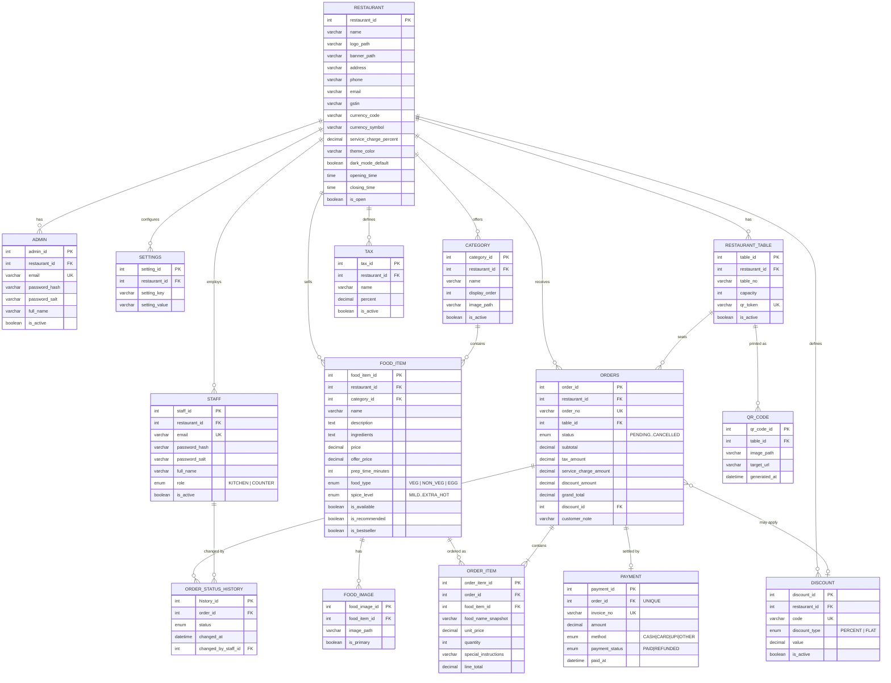

# Entity-Relationship Diagram

Source of truth: [`sql/schema.sql`](../sql/schema.sql). This document is a
readable companion to it, not a replacement.

## Notes on specific design choices

- **`restaurant_id` on every top-level table, even in a single-tenant
  deployment.** Strict child rows (`food_image`, `order_item`,
  `order_status_history`, `payment`, `qr_code`) don't repeat it - they
  reach it by joining through their parent. This keeps the schema
  normalized today while making a future multi-branch/multi-tenant feature
  a `WHERE`-clause change, not a migration.
- **`tax` is a table, not a single `restaurant.tax_percent` column.** A
  restaurant can configure any number of named tax lines (CGST + SGST,
  a single GST, VAT, ...) and the bill/invoice renders them all by name.
- **`order_item.food_name_snapshot` and `unit_price` are copies**, taken at
  order time. Renaming, repricing, or deleting a food item later never
  rewrites a historical bill.
- **`payment` only gets a row once an order is actually settled.** No row
  for an order means "unpaid" - there's no separate `payment_status` flag
  to keep in sync on `orders` itself.
- **`order_status_history` is append-only.** It powers both the
  customer-facing tracking timeline and the admin-facing peak-hours /
  order-trend reports without recomputing anything from `orders.updated_at`
  alone.
- **`restaurant_table.qr_token` is a random opaque string**, not the
  numeric `table_id`, and is what the no-login customer flow actually
  trusts to resolve `?table=&token=` to a real table - the numeric id in
  the URL is there only for human readability.
- **Inventory-ready by omission**: no inventory tables exist yet, but
  `food_item_id` is a stable FK target a future `inventory_item` /
  `food_item_ingredient` table can reference without touching any existing
  column.
